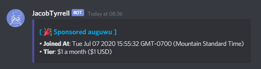
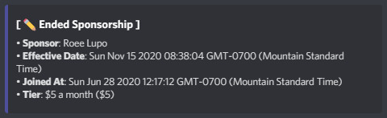
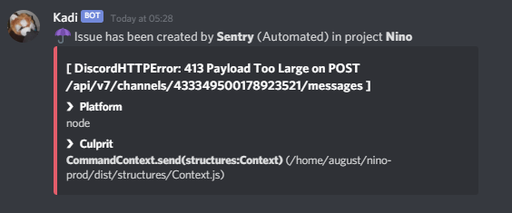
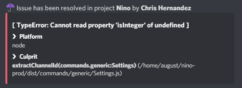
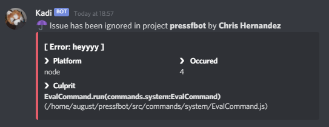
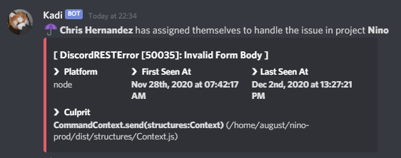
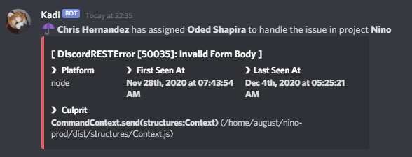

# webhook.floofy.dev
> 🌰 **Internal API for webhook systems made in Node.js using Express**

## GitHub Sponsors
### Sponsorship Created


### Sponsorship Deleted


## Sentry
### Created


### Resolved


### Ignored


### Assigned (self)


### Assigned (normal)


## Installation
### Requirements
- Docker (optional)
- Node.js v10 or higher

### Process (locally)
- [Fork](https://github.com/auguwu/webhooks/fork) this repository and clone it on your machine (``git clone https://github.com/$USERNAME/webhooks``), omit `$USERNAME` with your GitHub username
- Change the directory to where you forked the repository and run `npm install`, this should install all dependencies
- Follow the [configuration](#configuration) guide
- Run the application with `npm start` and it should be booted up!

### Process (Docker, locally)
> This process is recommended for production environments!
>
> If you are running Windows or macOS, install **Docker Desktop** before continuing.
>
> If you wanna use a custom port, bind the port to `3621` (`-p <port>:3621`, ex. `-p 9999:3621`)

- [Fork](https://github.com/auguwu/webhooks/fork) this repository and clone it on your machine (``git clone https://github.com/$USERNAME/webhooks``), omit `$USERNAME` with your GitHub username
- Follow the [configuration](#configuration) guide
- Create the image with `npm run docker:build`, it should create an image called `webhooks` with the `latest` tag.
- Run the image with `npm run docker:run`, it should create a container with a specified ID and it should be running!

### Process (Docker, registry)
> This process is recommended to not clone the repository and re-build the image every-time a change is made.
>
> New images are built on every release, so you can repeat this process!

- Run `docker pull registry.floofy.dev/webhooks` to get the latest image available
- Run `docker run -d -p 3621:3621 registry.floofy.dev/webhooks` to run the image, it should create a default file
if on first installation and should be running. It should print out a image ID, which is crucial for endpoints.
- Run `docker exec -it <image ID> /bin/sh` to create a bash session, run `ls` to check if everything is working!
- Edit the `.env` file with the valid [configuration](#configuration) to your liking.
- Restart the container (`docker restart <image ID>`)

## Docker Compose Example
```yml
services:
  webhooks:
    restart: always
    image: registry.floofy.dev/webhooks
    ports:
      - 'custom:3621'
```

## Configuration
```env
# The webhook URL (required)
DISCORD_WEBHOOK_URL=

# Endpoints you wanna use, seperated using `,`
ENDPOINTS=/github,/sentry,/docker

# The environment of the application
# Accepts: 'development' or 'production'
NODE_ENV=

# The secret for validating data
# Run `node -e 'console.log(require("crypto").randomBytes(16).toString("hex"))'` to generate a random SECRET key
SECRET=

# The port of the server to run on
# Default: 3621
PORT=
```

## Setup
> Once you gotten the service setup, you can use the following steps on how to use it:

### Github Sponsors
1. Go to your Sponsors dashboard
2. Go under **Webhooks** and click "Create new Webhook"
3. Fill in the details of what you want to receive, the service will send notifications on events:
  - Create
  - Pending Tier Change
  - Tier Change Success
  - Cancelling
  - Cancelled
4. Make sure the content type is **application/json**, the secret is the same in your `.env` file, and it's activated

### Sentry
1. Go to your organization dashboard
2. Go to "Developer Settings" tab
3. Click "+ Create new Internal Integration"
4. Fill in the details to what you wanna receive, the service will send notifications on events:
  - **Unresolved Issue**
  - **Resolved Issue**
  - **Ignored Issue**

### Docker Registry
Coming soon.

## License
**webhooks** is released under the [MIT](/LICENSE) license.
